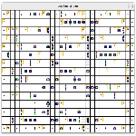

# Simulation de Trafic Urbain

## 📚 Table des Matières

1. [📜 Description](#-description)
2. [✨ Fonctionnalités](#-fonctionnalités)
3. [📸 Aperçu Visuel](#-aperçu-visuel)
4. [📋 Prérequis](#-prérequis)
5. [⚙️ Installation](#️-installation)
6. [🚀 Lancement](#-lancement)
7. [🎮 Contrôles](#-contrôles)
8. [🏗️ Structure du Code](#️-structure-du-code)
9. [💡 Pistes d'Amélioration](#-pistes-damélioration)
10. [👥 Auteurs](#-auteurs)

---

## 📜 Description

Ce projet est une **simulation 2D de trafic routier** développée en Python avec la bibliothèque **Pygame**. Il met en scène un réseau routier basé sur une grille où circulent des véhicules autonomes, des piétons et des feux de signalisation dynamiques.

L'objectif principal est de modéliser les interactions complexes dans un environnement urbain simplifié :
* Les **voitures** tentent d'atteindre des destinations aléatoires en utilisant l'algorithme A* pour le calcul d'itinéraire.
* Elles respectent les **sens de circulation** (alternés pour les lignes et colonnes).
* Elles obéissent aux **feux tricolores** placés stratégiquement.
* Elles doivent éviter les collisions entre elles et céder le passage aux **piétons** traversant sur les passages dédiés.
* L'utilisateur peut interagir avec la simulation en ajoutant ou retirant des **obstacles** (murs) via la souris, forçant les voitures à adapter leurs trajets.

---

## ✨ Fonctionnalités

* **Grille Routière Configurable :** Dimensions de la fenêtre et taille des cellules ajustables.
* **Sens de Circulation :** Voies à sens unique alternées horizontalement et verticalement.
* **Véhicules Autonomes :**
  * Recherche de chemin avec l'algorithme A*.
  * Génération aléatoire des points de départ et d'arrivée.
  * Déplacement fluide et respect des délais.
  * Évitement des collisions avec obstacles et autres véhicules.
* **Feux de Signalisation :**
  * Cycle classique Vert -> Orange -> Rouge.
  * Durées configurables.
  * Placement semi-aléatoire avec contraintes.
* **Piétons :**
  * Apparition probabiliste sur les passages piétons dédiés.
  * Traversée à vitesse constante.
* **Obstacles Dynamiques :** Ajout/suppression d'obstacles en temps réel.
* **Interaction Utilisateur :** Contrôles simples pour la gestion des obstacles.

---

## 📸 Aperçu Visuel

<p align="center">
    
</p>


---

## 📋 Prérequis

Avant de lancer la simulation, assurez-vous d'avoir installé :

*   **Python :** Version 3.x (développé initialement pour 3.12, mais probablement compatible avec d'autres versions 3.x). Vous pouvez le télécharger sur [python.org](https://www.python.org/downloads/).
*   **Pip :** Le gestionnaire de paquets pour Python (généralement inclus avec les installations récentes de Python).
*   **Pygame :** La bibliothèque graphique et multimédia utilisée. Version 2.x ou supérieure recommandée.

---

## ⚙️ Installation

Suivez ces étapes pour configurer et installer le projet localement :

1.  **Cloner ou Télécharger le Dépôt :**
    Si le projet est sur une plateforme comme GitHub :
    ```bash
    git clone <https://github.com/ARE24-25/Circulation_routiere.git>
    cd Circulation_routiere
    ```
    Sinon, téléchargez l'archive ZIP du code source et extrayez-la dans un dossier de votre choix.

2.  **Naviguer vers le Dossier du Projet :**
    Ouvrez un terminal ou une invite de commandes et déplacez-vous dans le répertoire principal du projet (celui qui contient le fichier `simulation_trafic.py`).
    ```bash
    cd chemin/vers/votre/projet
    ```

3.  **Créer un Environnement Virtuel (Fortement Recommandé) :**
    Cela isole les dépendances de votre projet des autres projets Python sur votre système.
    ```bash
    python -m venv venv
    ```

4.  **Activer l'Environnement Virtuel :**
    *   Sur **Windows** (cmd/powershell) :
        ```bash
        .\venv\Scripts\activate
        ```
    *   Sur **macOS / Linux** (bash/zsh) :
        ```bash
        source venv/bin/activate
        ```
    Vous devriez voir `(venv)` apparaître au début de votre invite de commandes.

5.  **Installer les Dépendances :**
    La seule dépendance externe est Pygame. Installez-la via pip :
    ```bash
    pip install pygame
    ```

6.  **(Optionnel mais Recommandé) Image de Voiture :**
    *   Assurez-vous qu'une image nommée `car.png` est présente dans le **même dossier** que `simulation_trafic.py`.
    *   Si l'image n'est pas trouvée au lancement, la simulation fonctionnera quand même, mais les voitures seront représentées par de simples cercles colorés.

---

## 🚀 Lancement

Une fois l'installation terminée et l'environnement virtuel activé (`(venv)` visible dans le terminal), lancez la simulation en exécutant le script Python :

```bash
python3 simulation_trafic.py 
```

---

## 🎮 Contrôles
* **Clic Gauche Souris : Cliquez sur une case vide (qui n'est pas un feu) pour y placer un obstacle (mur noir). Les voitures tenteront de contourner les nouveaux obstacles.**

* **Clic Droit Souris : Cliquez sur une case contenant un obstacle ('X') pour le retirer.**

* **Touche Échap (Escape) : Appuyez sur cette touche pour quitter la simulation proprement.**

* **Bouton Fermer (Fenêtre) : Cliquez sur la croix de fermeture de la fenêtre pour quitter la simulation.**

---


## 🏗️ Structure du Code

Structure principale du fichier simulation_trafic.py :

.
├── Initialisation Pygame
├── Constantes globales
├── Fonctions utilitaires
├── Gestion piétons
├── Gestion feux
├── Gestion voitures
└── Boucle principale

---


## 📄 Documentation Technique (Doxygen)
Une documentation technique détaillée du code source a été générée à l'aide de Doxygen. Elle est basée sur les commentaires structurés (style Doxygen/Javadoc) présents directement dans le fichier simulation_trafic.py.

Cette documentation fournit des informations sur :

Le but de chaque fonction.

Les paramètres d'entrée et leur signification.

Les valeurs de retour.

Les constantes globales et leur utilité.

Pour consulter la documentation :

(Prérequis pour la Génération) : Si vous souhaitez la générer vous-même, assurez-vous d'avoir installé Doxygen.

(Génération) : Ouvrez un terminal à la racine du projet (là où se trouve le fichier Doxyfile) et exécutez la commande :


```bash
doxygen
```
(Accès) : La documentation HTML est générée par défaut dans le sous-dossier docs/html/. Ouvrez le fichier suivant dans votre navigateur web :

```bash
docs/html/index.html
```
---

## 💡 Pistes d'Amélioration

* **Interface utilisateur améliorée**

* **Différents types de véhicules**

* **Gestion des intersections complexes**

* **Optimisation des performances**

---

## 👥 Auteurs

* **Sokhna Oumou DIOUF** 

* **Rym BENOUMECHIARA** 
